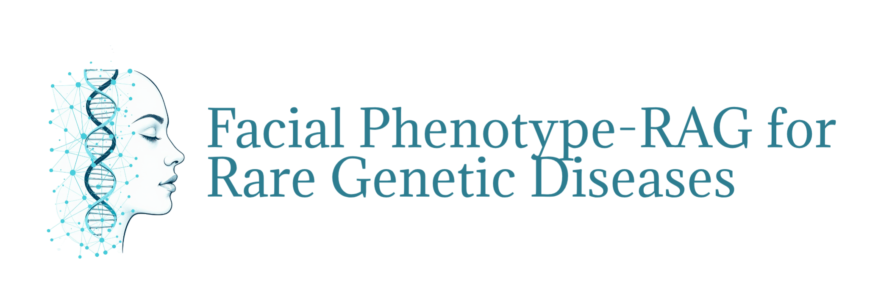
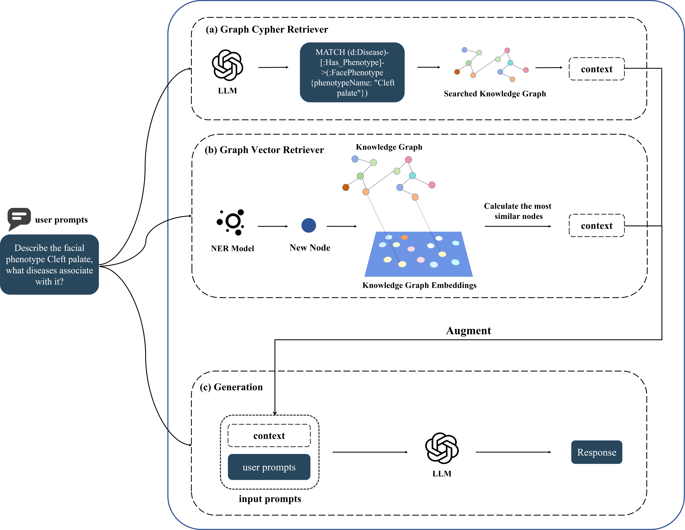
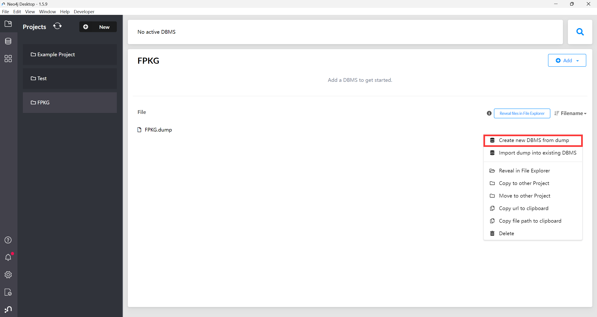
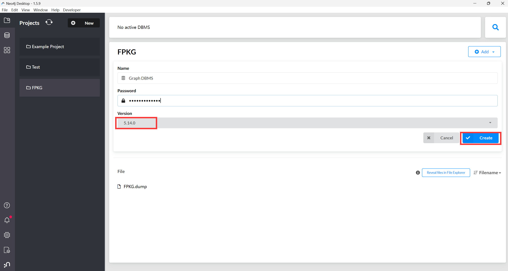
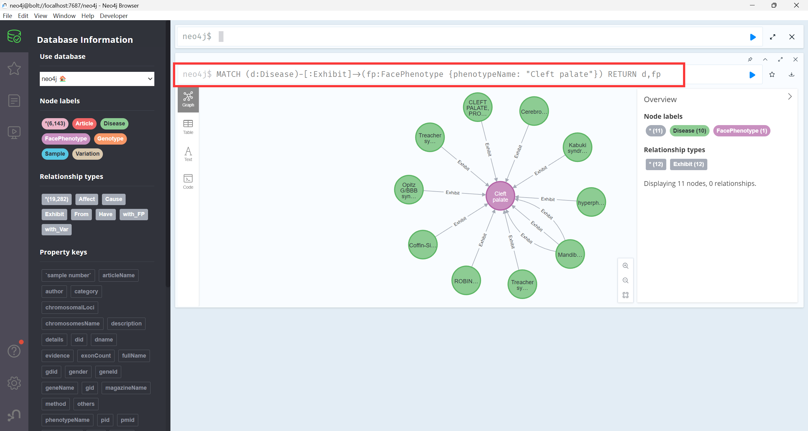

<div align="center">    
 
# Graph Retrieval Augmented Large Language Models for Facial Phenotype Associated Rare Genetic Disease     


</div>

[](https://opensource.org/licenses/MIT)

 


## Table of Contents
- [Overview](#overview)
- [Knowledge Graph Install](#knowledge-graph-install)
- [Datasets](#datasets)
- [Codes Requirements](#codes-requirements)
- [Model Weight](#model-weights)
- [Contact](#contact)
- [Citation](#citation)
 
## Overview   
This is the official PyTorch implementation of the paper __"Graph Retrieval Augmented Large Language Models for Facial Phenotype Associated Rare Genetic Disease"__.





## Knowledge Graph Install
Requirements: [Neo4j Desktop](https://neo4j.com/download/)

First, put dump file in project dirctory, and create new DBMS from dump. 


Second, create DBMS, make sure your version is 5.14.0. 


Third, here is an example of a Cypher query to retrieve data from the Knowledge Graph: __"MATCH (d:Disease)-[:Exhibit]->(fp:FacePhenotype {phenotypeName: "Cleft palate"}) RETURN d,fp"__. 

KG in json format can be obtained by displaying the full relationship and then exporting it.


## Datasets
The Domain Knowledge set, Publication set, and GMDB set are all stored in the Datasets folder. Due to the restricted access agreement of the GMDB set, we have replaced all key information with "*****". However, we have retained the patient IDs in the GMDB. You can apply for access to the [GMDB](https://db.gestaltmatcher.org/) yourself and use the patient IDs to reproduce the paper.

## Codes Requirements
1. Clone the repository:
 ```bash
 git clone https://github.com/{USERNAME}/{REPO_NAME}.git
 cd FPKGRAG
 ```

2. Create a conda environment and install the required dependencies:
```bash
conda create -n {ENV_NAME} python=3.10
conda activate {ENV_NAME}
pip install -r requirements.txt
```


## Model weights
Our NER model weight is [here](https://huggingface.co/hfchloe/FP_NER/tree/main), please put it in ./results/checkpoint directory


## Contact
For technical questions please open issue, or contact:
- Jie Song <songjie02_09@163.com>

## Citation
```
Bibtex Citation
```# 
