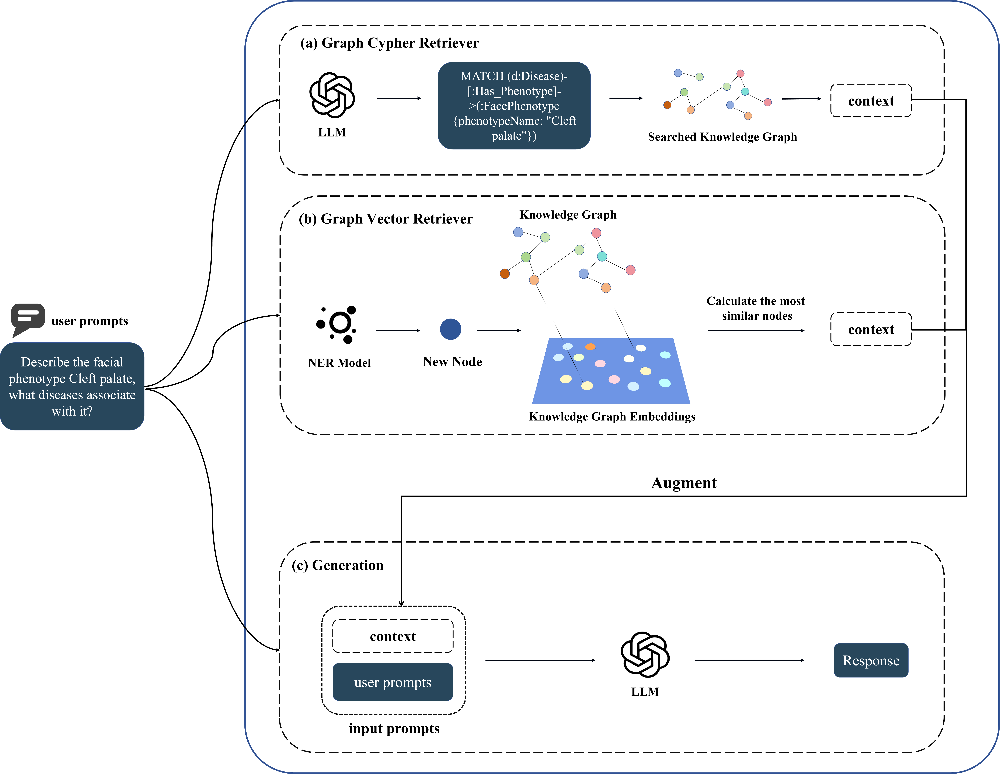
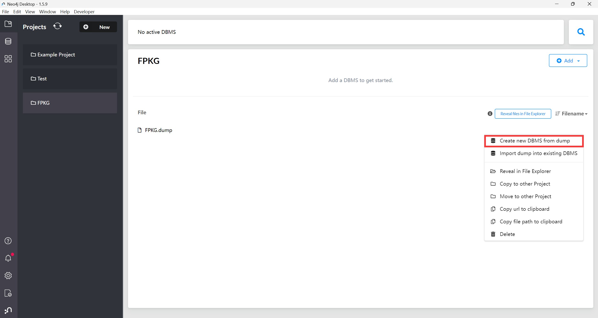
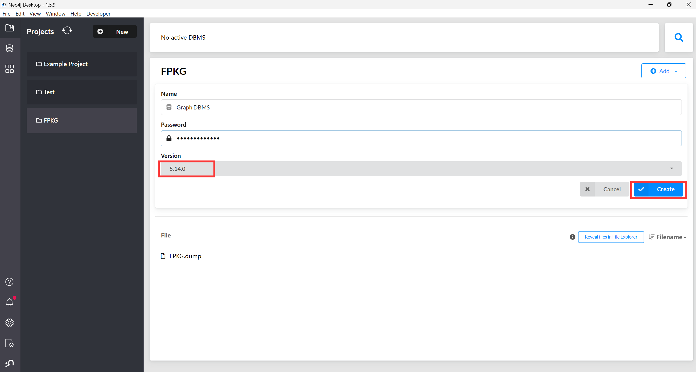
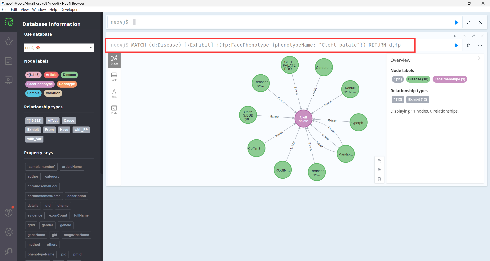

<div align="center">    
 
# Graph Retrieval-Augmented Large Language Models for Facial Phenotype Associated Rare Genetic Disease     


</div>

## Table of Contents
- [Overview](#overview)
- [Knowldege Graph Usage](#knowledge-graph-usage)
- [Codes Requirements](#codes-requirements)
- [Model Weight](#model-weights)
- [Citation](#citation)
 
## Overview   
This is the official PyTorch implementation of the paper __"Graph Retrieval-Augmented Large Language Models for Facial Phenotype Associated Rare Genetic Disease"__.

<br/>



## Knowledge Graph Usage
Requirements: [Neo4j Desktop](https://neo4j.com/download/)

First, put dump file in project dirctory, and create new DBMS from dump. 


Second, create DBMS, make sure your version is 5.14.0. 


Third, here is an example of a Cypher query to retrieve data from the Knowledge Graph: __"MATCH (d:Disease)-[:Exhibit]->(fp:FacePhenotype {phenotypeName: "Cleft palate"}) RETURN d,fp"__. 

KG in json format can be obtained by displaying the full relationship and then exporting it.


## Codes Requirements
1. Clone the repository:
 ```bash
 git clone https://github.com/{USERNAME}/{REPO_NAME}.git
 cd FPKGRAG
 ```

2. Create a conda environment and install the required dependencies:
```bash
conda create -n {ENV_NAME} python=3.10
conda activate {ENV_NAME}
pip install -r requirements.txt
```


## Model weights
Our NER model weight is [here](https://huggingface.co/hfchloe/FP_NER/tree/main), please put it in ./results/checkpoint directory


## Citation
```
Bibtex Citation
```# Facial-Phenotype-RAG
